# Práctica 1:

**Autor:** Carlos Martín de Argila Lorente

**Clase:** 3AGITT

## Fork:
Lo primero que he hecho es un fork fork sobre el [repositorio](https://github.com/gitt-3-pat/hello-world):
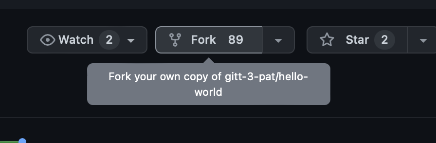

El comando *fork* nos permite crear una copia de un repositorio en nuestra cuenta personal. Con esta copia, podemos realizar cambios en el código sin afectar al repositorio original, así podemos modificar código que ha hecho otra persona sin tener que pedirle permiso.

## **GIT:**

* **Git clone:** Este comando se utiliza para clonar un repositorio remoto a un directorio local en el sistema de archivos. Se utiliza para descargar todos los archivos y historial de versiones de un repositorio en una computadora local.

    **Log de la ejecución del comando:**
    ```
    (base) carlos@MacBook-Pro-de-Carlos ~ % git clone https://github.com/gitt-3-pat/hello-world
    Cloning into 'hello-world'...
    remote: Enumerating objects: 38, done.
    remote: Counting objects: 100% (4/4), done.
    remote: Compressing objects: 100% (4/4), done.
    remote: Total 38 (delta 0), reused 0 (delta 0), pack-reused 34
    Receiving objects: 100% (38/38), 59.56 KiB | 315.00 KiB/s, done.
    ```

* **Git status:** Este comando muestra el estado actual del repositorio local. Muestra los archivos modificados, agregados o eliminados que aún no han sido rastreados o confirmados.

    **Log de la ejecución del comando:**
    ```
    (base) carlos@MacBook-Pro-de-Carlos html % git status
    On branch main
    Your branch and 'origin/main' have diverged,
    and have 1 and 1 different commits each, respectively.
    (use "git pull" to merge the remote branch into yours)

    Changes not staged for commit:
    (use "git add <file>..." to update what will be committed)
    (use "git restore <file>..." to discard changes in working directory)
            modified:   footer.html
            modified:   plantilla.html

    no changes added to commit (use "git add" and/or "git commit -a")
    ```
    Como vemos en el log, tenemos dos archivos que han sido modificados no están staged para el commit (es decir que hay que hacer un add para que estén listos para el commit). Para obtener esto estoy mirando el repositorio desde el cual estoy haciendo la página web de la práctica 2.

* **Git add:** Este comando agrega archivos al área de stage, donde se preparan para ser confirmados en el próximo commit.
    
    **Log de la ejecución del comando:**
    ```
    (base) carlos@MacBook-Pro-de-Carlos html % git add footer.html 
    (base) carlos@MacBook-Pro-de-Carlos html % git add plantilla.html 
    ```
    Hemos hecho un add de los dos archivos que hemos modificado y ahora si hacemos un git status, vemos que ahora aparecen como **Changes to be committed:**:
    ```
    Changes to be committed:
  (use "git restore --staged <file>..." to unstage)
        modified:   footer.html
        modified:   plantilla.html
    ```

* **Git commit:** Este comando confirma los cambios en el repositorio local y crea un punto en el historial de versiones.
    
    **Log de la ejecución del comando:**
    ```
    (base) carlos@MacBook-Pro-de-Carlos html % git commit -m "Cambios en el footer y en la plantilla"

    [main 96c4fa1] Cambios en el footer y en la plantilla
    2 files changed, 3 insertions(+), 5 deletions(-)
    ```
    En este caso he hecho un commit con el mensaje "Cambios en el footer y en la plantilla". Como vemos en el log, se han modificado dos archivos y se han añadido 3 líneas y se han eliminado 5. Se han efectuado cambios en los archivos footer.html y plantilla.html.

* **Git push:** Este comando enviará los cambios confirmados al repositorio remoto.
        
    **Log de la ejecución del comando:**
    ```
    (base) carlos@MacBook-Pro-de-Carlos html % git push

    Enumerating objects: 9, done.
    Counting objects: 100% (9/9), done.
    Delta compression using up to 8 threads
    Compressing objects: 100% (5/5), done.
    Writing objects: 100% (5/5), 455 bytes | 455.00 KiB/s, done.
    Total 5 (delta 3), reused 0 (delta 0), pack-reused 0
    remote: Resolving deltas: 100% (3/3), completed with 3 local objects.
    To https://github.com/Carlos-ag/Website.git
    ef98414..45518ff  main -> main
    ```

* **Git checkout:** Es una herramienta poderosa en el flujo de trabajo de Git que te permite cambiar fácilmente entre ramas, descartar cambios y navegar por el historial de tu repositorio.
    **Log de la ejecución del comando:**
    Podemos usarlo para diferentes cosas. 
    
    Por ejemplo, para rear una nueva rama y cambiar a ella:
    ```
    (base) carlos@MacBook-Pro-de-Carlos html % git checkout -b rama_footer         
    Switched to a new branch 'rama_footer'
    ```
    Descartar cambios en un archivo:
    ```
    (base) carlos@MacBook-Pro-de-Carlos html % git checkout footer.html
    Updated 1 path from the index
    ```
    
* **git branch -l** para ver todas las ramas que tengo en el repositorio:
    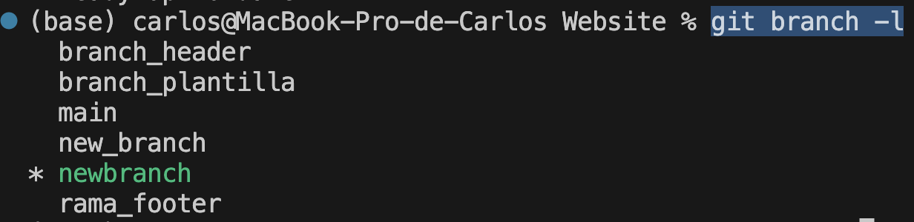
* **git branch -d** para borrar ramas:
    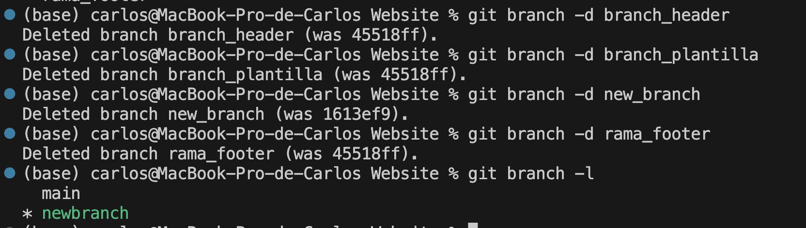

* **git pull** para traer los cambios del repositorio remoto:
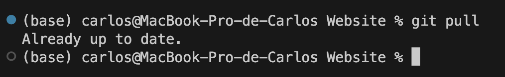

* **git log** es una herramienta muy útil en Git que permite ver el historial de cambios en un repositorio. También puedes ver información detallada sobre cada commit en tu repositorio, incluyendo el autor, la fecha, el mensaje de commit y el hash de identificación único (SHA) del commit:
    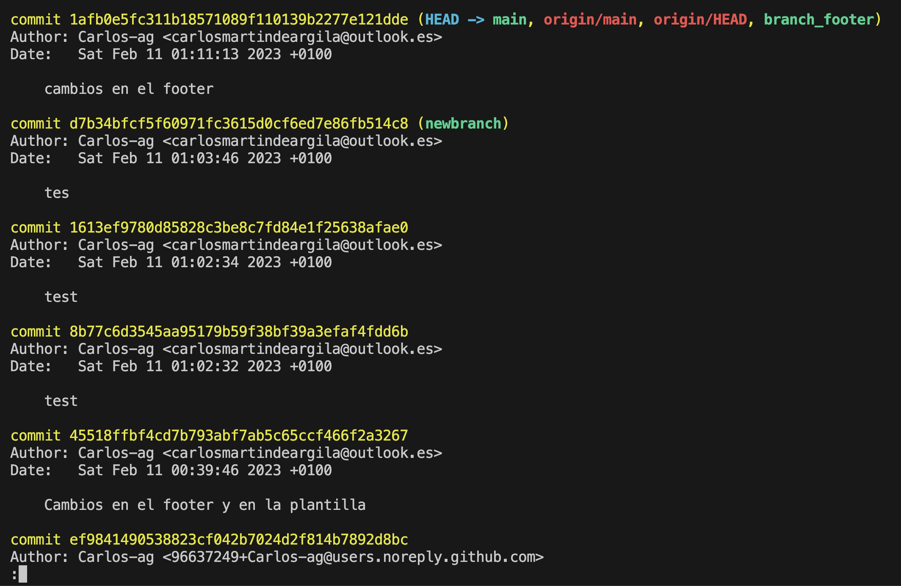

* **git revert** para revertir un commit. Es muy útil cuando se ha hecho un commit y se ha subido a un repositorio remoto y luego se quiere deshacer ese commit. Necesitamos saber el hash del commit que queremos revertir. Para ello usamos el comando **git log** que acabamos de explicar. Por ejemplo, en el caso de la captura de arriba, vamos a revert el cambio *45518ffbf4cd7b793abf7ab5c65ccf466f2a3267*:

    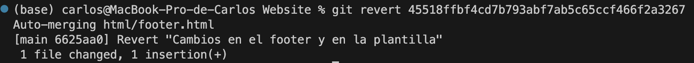


* Voy a añadir un par de comandos que son los que suelo utilizar más a menudo yo. Cuando trabajo con git (seguro que hay prácticas mucho mejores pero me he acostumbrado así), lo que suelo hacer es crearme una nueva rama donde hago ahi los cambios, después de haber añadido todos los cambios hago un merge con la rama main y ya luego los pusheo. Por tanto los comando que más uso yo son:
    - **git branch nombre_rama**: para crear la nueva rama
    - **git switch nombre_rama**: para cambiar a la rama
    - **git add .**: para añadir todos los cambios
    - **git commit -m "mensaje"**: para hacer el commit
    - **git switch main**: para cambiar a la rama main
    - **git merge nombre_rama**: para hacer el merge con la rama main
    - **git push origin main**: para hacer el push de los cambios

    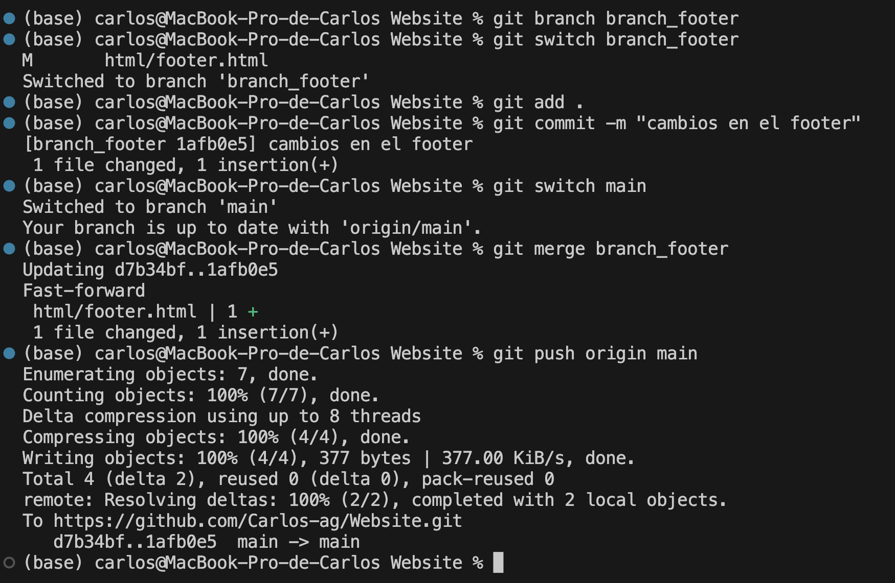


## **Instalaciones en el equipo:**
* Java 17: El año pasado en la clase de POO ya instalamos Java. Tengo varias versiones de Java instaladas porque hay algún programa que uso que requiere una version específica. 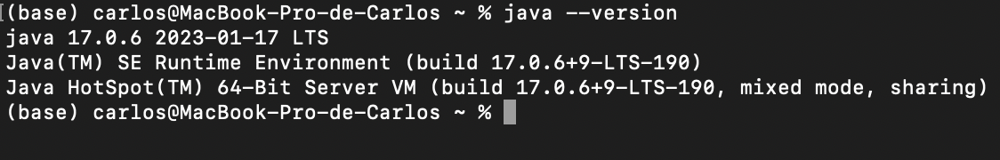
* Maven: para instalar maven he usado Homebrew: 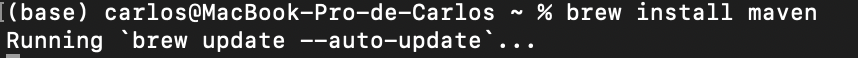
* Docker: Para instalar Docker, lo he hecho desde su página web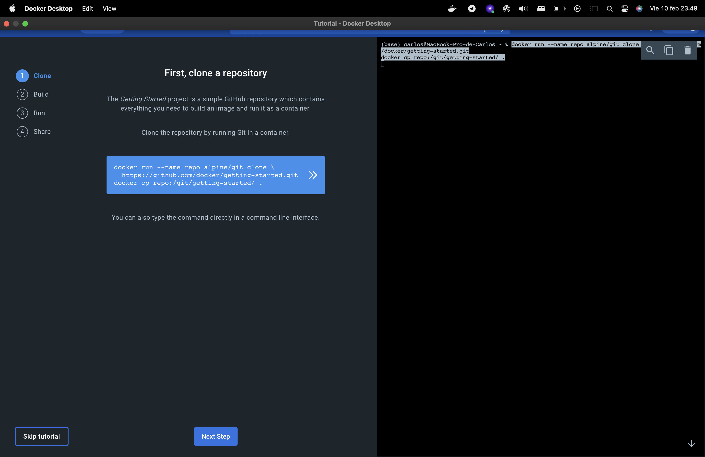
* Editor de código fuente (**VsCode**): Visual Studio Code es el editor de código que llevo usando desde hace muchos años tanto como para programar como para escribir documentos en Markdown.
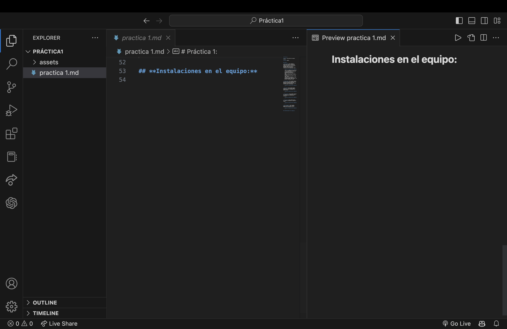


